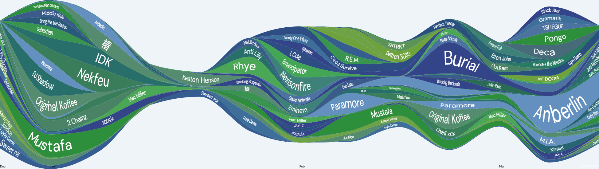

# LastWave

Graph your music listening history!



## What does it do?

LastWave is a web app that takes data from your [last.fm](https://last.fm) profile and creates a beautiful wave graph (streamgraph) that represents your music listening trends by artist, album, or tag. The artists you listen to more at a given time have a larger area on the graph.

## Tech Stack

- **[Astro](https://astro.build/)** — Static site generation with islands architecture
- **[React](https://react.dev/)** — Interactive UI components
- **[D3.js v7](https://d3js.org/)** — Streamgraph visualization
- **[Tailwind CSS](https://tailwindcss.com/)** — Utility-first styling
- **[Zustand](https://zustand.docs.pmnd.rs/)** — Lightweight state management
- **[TypeScript](https://www.typescriptlang.org/)** — Type safety throughout
- **[Vitest](https://vitest.dev/)** + **[React Testing Library](https://testing-library.com/react)** — Unit & component tests
- **[Playwright](https://playwright.dev/)** — End-to-end tests

## How does it work?

The wave graph is rendered entirely in the browser as SVG using D3.js. Key algorithms include:

- **Bezier curve fitting** — smooth curves fitted to wave shapes for text placement
- **Deformed text** — text is bent along wave contours using spline-based character placement

LastWave supports grouping by artist, album, or tag, with genre lookup via Wikidata, MusicBrainz, and Last.fm. Finished graphs can be exported as SVG or PNG, or shared to a public gallery via Cloudinary.

## Getting Started

```bash
git clone https://github.com/taurheim/LastWave.git
cd LastWave
npm install
npm run dev
# Open http://localhost:4321
```

## Project Structure

```
src/
├── core/               # Framework-agnostic business logic
│   ├── models/         # Data models (Point, Peak, Label, SeriesData, etc.)
│   ├── lastfm/         # Last.fm API client & data processing
│   ├── wave/           # Label placement & deformed text algorithms
│   ├── genres/         # Genre lookup (Wikidata → MusicBrainz → Last.fm)
│   ├── config/         # Color schemes, date presets
│   └── cloudinary/     # Image upload API
├── components/         # React components (visualization, options, gallery, etc.)
│   └── lab/            # Dev-only slice lab for testing label placement
├── layouts/            # Astro layouts
├── pages/              # Routes: /, /about, /gallery
├── pages-dev/          # Dev-only routes (/lab)
└── store/              # Zustand state management
tests/
├── unit/               # Core logic tests (wave accuracy, models, API, SVG snapshots)
├── component/          # React component tests
├── e2e/                # Playwright E2E tests
└── fixtures/           # Test data & accuracy baselines
```

## Development

See [DEVELOPMENT.md](DEVELOPMENT.md) for the full development workflow, commands, spec-driven process, and validation details.

## How to Contribute

LastWave is always looking for contributors! Check out the [issues](https://github.com/taurheim/LastWave/issues) section to see what needs doing. Questions? Contact niko@savas.ca.
